# 🚀 Phase 2 Day 4: Advanced Task Features - Strategic Overview

## 🎯 What's Next: Phase 2 Day 4 - Advanced Task Features

### **Core Objectives**
Building upon our solid task management foundation, Day 4 focuses on **sophisticated task functionality** that transforms basic task management into an **enterprise-grade productivity platform**.

### **Planned Implementation Tasks**

#### 1. **Enhanced Time Tracking System** ⏱️
**Current State**: Basic `estimated_hours` and `actual_hours` fields  
**Day 4 Enhancement**:
- **Time Log Entries**: Detailed time tracking with start/stop functionality
- **Billable Hours**: Track client vs internal work
- **Time Reports**: Generate productivity analytics
- **Time Validation**: Prevent time tracking conflicts

```python
# New Model: TaskTimeLog
class TaskTimeLog(Base):
    id: int
    task_id: int
    user_id: int
    start_time: datetime
    end_time: Optional[datetime]
    duration_minutes: int
    description: str
    is_billable: bool = False
    created_at: datetime
```

#### 2. **Advanced Comment System & Activity Logs** 💬
**Current State**: Basic task comments  
**Day 4 Enhancement**:
- **Rich Text Comments**: Markdown support, file attachments
- **@Mentions**: Notify specific team members
- **Activity Timeline**: Automatic logging of all task changes
- **Comment Threading**: Nested discussions

#### 3. **Task Templates & Workflows** 📋
**Current State**: Manual task creation  
**Day 4 Enhancement**:
- **Task Templates**: Predefined task structures for common work
- **Workflow Automation**: Status transition rules and triggers
- **Template Categories**: Department-specific templates
- **Bulk Task Creation**: Create multiple tasks from templates

#### 4. **Intelligent Task Assignment** 👥
**Current State**: Basic assignee field  
**Day 4 Enhancement**:
- **Assignment History**: Track reassignment patterns
- **Workload Balancing**: Prevent team member overload
- **Assignment Notifications**: Real-time assignment alerts
- **Assignment Rules**: Auto-assign based on criteria

#### 5. **Task Analytics & Insights** 📊
**Current State**: Basic task data  
**Day 4 Enhancement**:
- **Productivity Metrics**: Completion rates, time efficiency
- **Team Performance**: Individual and team analytics
- **Project Health**: Task distribution and bottleneck identification
- **Predictive Analytics**: Delivery date predictions

---

## 🏗️ How This Builds on Our Current Foundation

### **Leveraging What We Built (Phase 2 Day 3)**

#### **Solid Database Architecture** ✅
Our current task models provide the perfect foundation:
- **Task Model**: Rich metadata ready for enhancement
- **TaskComment**: Comment system ready for advanced features
- **TaskDependency**: Workflow foundation already in place
- **Relationships**: User, Project, Organization connections established

#### **Professional API Pattern** ✅
Our FastAPI structure enables rapid expansion:
- **Consistent Patterns**: `/api/v1/tasks/` endpoints follow proven patterns
- **Authentication**: Project-based access control already implemented
- **Validation**: Pydantic schemas ready for new features
- **Error Handling**: Professional error responses established

#### **Enterprise Security** ✅
Multi-tenant architecture supports advanced features:
- **Project Isolation**: Task data properly segregated
- **Role-Based Access**: Foundation for advanced permissions
- **Audit Trails**: Activity logging infrastructure ready

### **Strategic Evolution Path**

```mermaid
graph TD
    A[Phase 1: Foundation] --> B[Phase 2 Day 3: Core Tasks]
    B --> C[Phase 2 Day 4: Advanced Features]
    C --> D[Phase 2 Day 5: Real-time Collaboration]
    D --> E[Phase 2 Day 6: File Management]
    E --> F[Phase 2 Day 7: Performance & Enterprise]
    
    B1[✅ Task CRUD<br/>✅ Comments<br/>✅ Dependencies] --> C1[⭐ Time Tracking<br/>⭐ Templates<br/>⭐ Analytics]
    C1 --> D1[⚡ WebSockets<br/>⚡ Live Updates<br/>⚡ Notifications]
    D1 --> E1[📁 File Attachments<br/>📁 File Preview<br/>📁 @Mentions]
    E1 --> F1[🚀 Redis Caching<br/>🚀 Advanced Search<br/>🚀 Webhooks]
```



---

## 🎯 Relevance to Overall Project Goals

### **Demonstrating Advanced Full-Stack Skills**

#### **Complex Business Logic** 🧠
Day 4 features showcase sophisticated programming:
- **Time Tracking**: Complex state management and calculations
- **Workflow Engine**: Rule-based automation systems
- **Analytics**: Data aggregation and mathematical computations
- **Template System**: Dynamic object creation and inheritance

#### **Enterprise Patterns** 🏢
Features mirror real-world enterprise requirements:
- **Audit Logging**: Compliance and change tracking
- **Template Systems**: Scalable process standardization
- **Analytics Dashboards**: Business intelligence capabilities
- **Notification Systems**: Professional communication workflows

#### **Performance Considerations** ⚡
Advanced features require optimization thinking:
- **Efficient Queries**: Time log aggregations and analytics
- **Caching Strategies**: Template and analytics caching
- **Background Processing**: Notification and report generation
- **Database Optimization**: Indexing for complex queries

### **Building Toward Phase 3 Frontend**

Day 4 backend features directly enable rich frontend experiences:

#### **Real-time Dashboards** 📊
- Analytics API → Interactive charts and graphs
- Time tracking API → Live productivity widgets
- Activity logs API → Real-time activity feeds

#### **Productivity Tools** ⚡
- Template API → Drag-and-drop task creation
- Workflow API → Visual workflow designers
- Assignment API → Team workload visualizations

#### **Professional UX** 💼
- Rich comment system → Collaborative discussion interfaces
- @Mention system → Professional communication flows
- Activity timeline → Comprehensive change tracking

---

## 🎯 Strategic Business Value

### **Competitive Differentiation**

#### **vs. Basic Task Managers** 
- **Templates**: Speed up recurring work processes
- **Time Tracking**: Professional time management and billing
- **Analytics**: Data-driven productivity insights
- **Workflows**: Automated process enforcement

#### **vs. Enterprise Solutions**
- **Cost Effective**: Full-featured without enterprise licensing
- **Customizable**: Open-source flexibility
- **Integration Ready**: API-first architecture
- **Performance**: Modern tech stack optimization

### **Target User Value**

#### **Individual Contributors** 👤
- **Time Insights**: Understand productivity patterns
- **Template Efficiency**: Faster task creation
- **Activity Clarity**: Clear work history and progress

#### **Team Leads** 👥
- **Workload Visibility**: Prevent team burnout
- **Process Standardization**: Consistent work templates
- **Performance Metrics**: Data-driven team management

#### **Project Managers** 📈
- **Project Health**: Real-time project analytics
- **Resource Planning**: Time tracking and forecasting
- **Process Optimization**: Workflow efficiency insights

---

## 🚀 Development Skills Demonstration

### **Phase 2 Day 4 Showcases:**

#### **Advanced Backend Development** ⚙️
- **Complex Data Models**: Time logs, templates, analytics schemas
- **Business Logic**: Workflow engines, validation rules, calculations
- **API Design**: Advanced endpoints with complex queries and aggregations
- **Performance**: Efficient queries for analytics and reporting

#### **Database Expertise** 🗄️
- **Advanced Relationships**: Many-to-many templates, complex joins
- **Aggregation Queries**: Time reporting, productivity metrics
- **Data Integrity**: Workflow validation, time tracking constraints
- **Migration Strategies**: Schema evolution with existing data

#### **System Architecture** 🏗️
- **Service Patterns**: Template service, analytics service, notification service
- **Event-Driven Design**: Workflow triggers, activity logging
- **Caching Strategies**: Template caching, analytics optimization
- **Integration Patterns**: Notification systems, webhook foundations

#### **Professional Development** 👨‍💼
- **Code Organization**: Clean service layers, proper abstractions
- **Testing Strategy**: Complex business logic testing
- **Documentation**: API documentation for advanced features
- **Error Handling**: Sophisticated validation and error responses

---

## 🎯 Ready for Phase 2 Day 4?

The foundation we built in Day 3 creates the **perfect launching point** for advanced features. Our clean architecture, professional patterns, and comprehensive testing ensure we can add sophisticated functionality without technical debt.

### **Success Metrics for Day 4:**
- ✅ **Professional Time Tracking**: Billable hours, detailed logs, reporting
- ✅ **Enterprise Templates**: Streamlined task creation workflows  
- ✅ **Intelligent Analytics**: Productivity insights and team metrics
- ✅ **Advanced Comments**: Rich text, mentions, activity timelines
- ✅ **Smart Assignment**: Workload balancing and notification systems

### **Impact on Career Demonstration:**
Phase 2 Day 4 elevates the project from "good task manager" to "enterprise productivity platform" - showcasing the advanced technical and business thinking expected from experienced full-stack developers.

**Ready to build features that make TeamFlow a serious competitor to enterprise solutions like Asana, Monday.com, and Jira!** 🚀